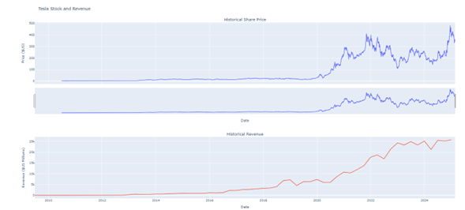
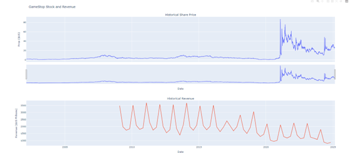

# Yfinance-Weebscraping-Proyect
In this proyect i use Yfinance and Weebscraping to obtain the historical stock and revenue data of "Tesla" and "GameStop" to build a dashboard using plotly with all the info

The final results of make_graph are:

